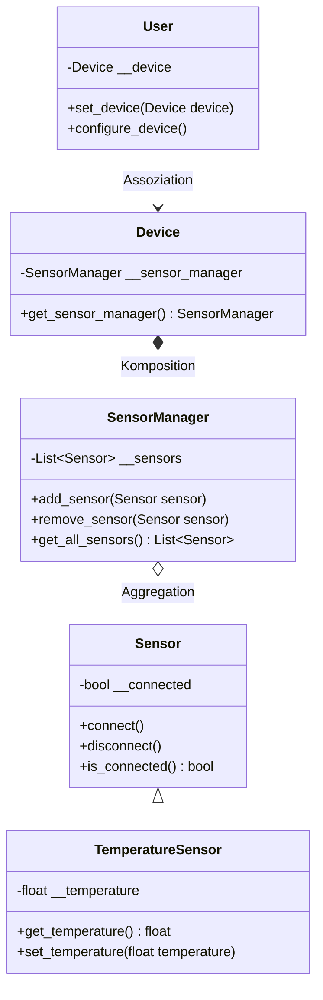

# Musterlösungen mit `main()`-Funktionen

[Zurück zur Info-Seite](./01_klassenbeziehungen.md)

Im Folgenden finden Sie die angepassten Musterlösungen, in denen die Inhalte der bisherigen 
`if __name__ == "__main__": ...`-Blöcke in eine separate `main()`-Funktion ausgelagert wurden.
Diese wird am Ende jeweils aus `if __name__ == "__main__": main()` aufgerufen.

---

## 1. Assoziation

```python
from typing import Optional

class Customer:
    __name: str

    def __init__(self, name: str) -> None:
        self.__name = name

    def get_name(self) -> str:
        return self.__name


class Order:
    __customer: Optional[Customer]

    def __init__(self) -> None:
        # Eine Order hat zunächst keinen Customer (Assoziation ist optional)
        self.__customer = None

    def set_customer(self, customer: Optional[Customer]) -> None:
        self.__customer = customer

    def get_customer(self) -> Optional[Customer]:
        return self.__customer

    def check_customer_status(self) -> str:
        if self.__customer is None:
            return "Hat keinen Kunden"
        else:
            return f"Hat Kunden: {self.__customer.get_name()}"


def main() -> None:
    # Test der Lösung
    bestellung_ohne_kunde = Order()
    print(bestellung_ohne_kunde.check_customer_status())  # "Hat keinen Kunden"

    kunde = Customer("Max Mustermann")
    bestellung_mit_kunde = Order()
    bestellung_mit_kunde.set_customer(kunde)
    print(bestellung_mit_kunde.check_customer_status())   # "Hat Kunden: Max Mustermann"


if __name__ == "__main__":
    main()
```

---

## 2. Aggregation

```python
from typing import List

class Car:
    __license_plate: str

    def __init__(self, license_plate: str) -> None:
        self.__license_plate = license_plate

    def get_license_plate(self) -> str:
        return self.__license_plate


class Garage:
    __cars: List[Car]

    def __init__(self) -> None:
        self.__cars = []

    def add_car(self, car: Car) -> None:
        self.__cars.append(car)

    def remove_car(self, car: Car) -> None:
        if car in self.__cars:
            self.__cars.remove(car)

    def list_cars(self) -> None:
        if not self.__cars:
            print("Keine Autos in der Garage.")
        else:
            for car in self.__cars:
                print(f"Auto mit Kennzeichen: {car.get_license_plate()}")


def main() -> None:
    # Test der Lösung
    garage = Garage()
    auto1 = Car("B-AB 123")
    auto2 = Car("M-XY 987")

    garage.add_car(auto1)
    garage.add_car(auto2)
    garage.list_cars()

    garage.remove_car(auto1)
    garage.list_cars()


if __name__ == "__main__":
    main()
```

---

## 3. Komposition

```python
class Door:
    __color: str

    def __init__(self, color: str) -> None:
        self.__color = color

    def get_color(self) -> str:
        return self.__color


class House:
    __door: Door

    def __init__(self) -> None:
        # Komposition: Das House erstellt die Door selbst.
        # Ohne House existiert diese Door nicht.
        self.__door = Door("Braun")

    def get_door_color(self) -> str:
        return self.__door.get_color()


def main() -> None:
    # Test der Lösung
    haus = House()
    print(f"Die Türfarbe ist: {haus.get_door_color()}")


if __name__ == "__main__":
    main()
```

---

## 4. Vererbung

```python
class Animal:
    __name: str

    def __init__(self, name: str) -> None:
        self.__name = name

    def get_name(self) -> str:
        return self.__name

    def make_sound(self) -> None:
        print("Unbekanntes Geräusch")


class Dog(Animal):
    def make_sound(self) -> None:
        print("Wuff")


class Cat(Animal):
    def make_sound(self) -> None:
        print("Miau")


def main() -> None:
    # Test der Lösung
    tier1 = Animal("Irgendein Tier")
    tier1.make_sound()  # "Unbekanntes Geräusch"

    hund = Dog("Bello")
    hund.make_sound()   # "Wuff"

    katze = Cat("Luna")
    katze.make_sound()  # "Miau"


if __name__ == "__main__":
    main()
```

---

## 5. Verwendung von `super()`

```python
class Book:
    __title: str
    __author: str

    def __init__(self, title: str, author: str) -> None:
        self.__title = title
        self.__author = author

    def get_title(self) -> str:
        return self.__title

    def get_author(self) -> str:
        return self.__author

    def read(self) -> None:
        print(f"Lese '{self.__title}' von {self.__author}.")


class EBook(Book):
    __file_size: float

    def __init__(self, title: str, author: str, file_size: float) -> None:
        # Aufruf des Basisklassen-Konstruktors
        super().__init__(title, author)
        self.__file_size = file_size

    def get_file_size(self) -> float:
        return self.__file_size

    def read(self) -> None:
        # Rufe zunächst die Basisklassenmethode auf
        super().read()
        print("Auf dem E-Reader wird das Buch digital dargestellt.")


def main() -> None:
    # Test der Lösung
    normales_buch = Book("1984", "George Orwell")
    normales_buch.read()

    ebook = EBook("Brave New World", "Aldous Huxley", 2.5)
    ebook.read()
    print(f"Dateigröße: {ebook.get_file_size()}MB")


if __name__ == "__main__":
    main()
```

---

## 6. Zusammenführung aller Konzepte



```python
from typing import List, Optional

# ----------------------
# Vererbung
# ----------------------
class Sensor:
    __connected: bool

    def __init__(self) -> None:
        self.__connected = False

    def connect(self) -> None:
        self.__connected = True

    def disconnect(self) -> None:
        self.__connected = False

    def is_connected(self) -> bool:
        return self.__connected


class TemperatureSensor(Sensor):
    __temperature: float

    def __init__(self) -> None:
        super().__init__()
        self.__temperature = 0.0

    def get_temperature(self) -> float:
        return self.__temperature

    def set_temperature(self, value: float) -> None:
        self.__temperature = value


# ----------------------
# Aggregation
# ----------------------
class SensorManager:
    __sensors: List[Sensor]

    def __init__(self) -> None:
        self.__sensors = []

    def add_sensor(self, sensor: Sensor) -> None:
        self.__sensors.append(sensor)

    def remove_sensor(self, sensor: Sensor) -> None:
        if sensor in self.__sensors:
            self.__sensors.remove(sensor)

    def get_all_sensors(self) -> List[Sensor]:
        return self.__sensors


# ----------------------
# Komposition
# ----------------------
class Device:
    __sensor_manager: SensorManager

    def __init__(self) -> None:
        # Komposition: Ein Device erstellt den SensorManager selbst.
        self.__sensor_manager = SensorManager()

    def get_sensor_manager(self) -> SensorManager:
        return self.__sensor_manager


# ----------------------
# Assoziation
# ----------------------
class User:
    __device: Optional[Device]

    def __init__(self) -> None:
        self.__device = None

    def set_device(self, device: Optional[Device]) -> None:
        self.__device = device

    def configure_device(self) -> None:
        if self.__device is None:
            print("Kein Gerät verbunden.")
        else:
            sensor_manager = self.__device.get_sensor_manager()
            # Beispiel: Alle Sensoren im Gerät verbinden
            for sensor in sensor_manager.get_all_sensors():
                sensor.connect()
            print("Alle Sensoren wurden konfiguriert und verbunden.")


def main() -> None:
    # Erstelle User und Device
    user = User()
    device = Device()

    # Füge dem Device (via SensorManager) mehrere Sensoren hinzu
    temp_sensor_1 = TemperatureSensor()
    temp_sensor_2 = TemperatureSensor()
    temp_sensor_2.set_temperature(36.6)

    sensor_manager = device.get_sensor_manager()
    sensor_manager.add_sensor(temp_sensor_1)
    sensor_manager.add_sensor(temp_sensor_2)

    # Assoziation: User setzt ein Device
    user.set_device(device)
    user.configure_device()

    # Sensorstatus prüfen
    for sensor in sensor_manager.get_all_sensors():
        print(f"Sensor connected? {sensor.is_connected()}")


if __name__ == "__main__":
    main()
```

---

**Hinweis:**  
Die gezeigten Lösungen dienen als Beispiel und können je nach Anforderung oder Projektrichtlinien natürlich 
angepasst werden. Wichtig ist das **Grundprinzip**, in dem die zuvor autark stehenden Tests im Hauptprogramm 
nun in eine `main()`-Funktion überführt werden, um saubere Einstiegspunkte zu definieren.
[Zurück zur Info-Seite](./01_klassenbeziehungen.md)