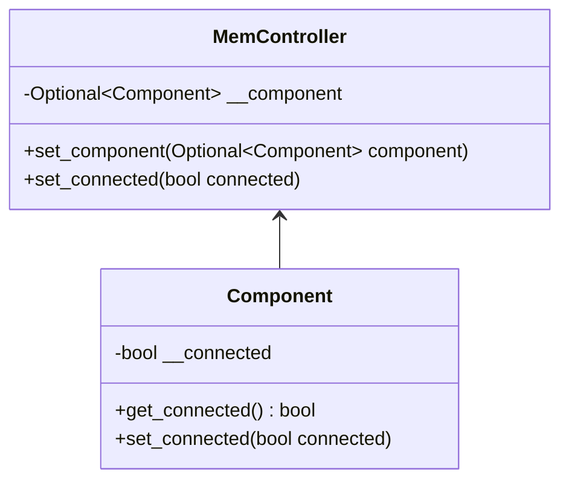
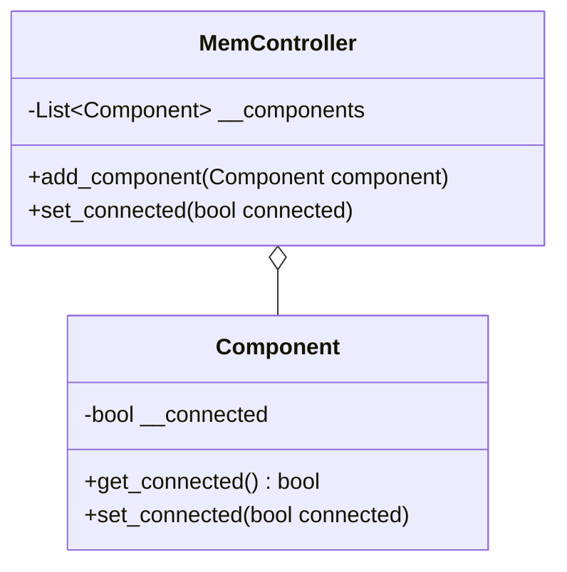
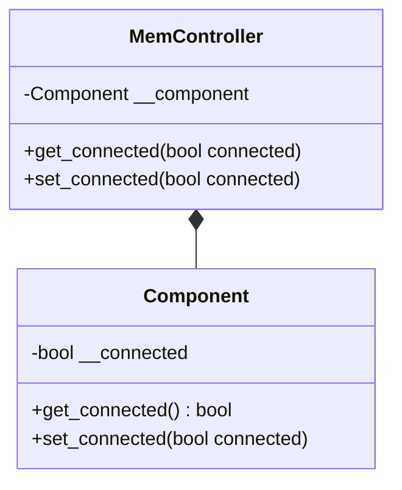
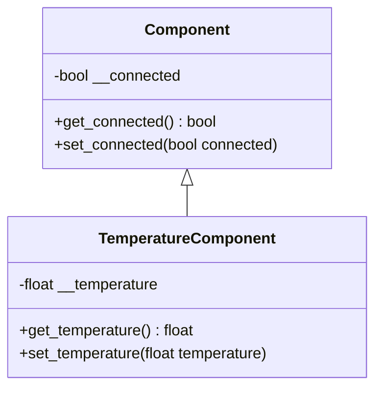
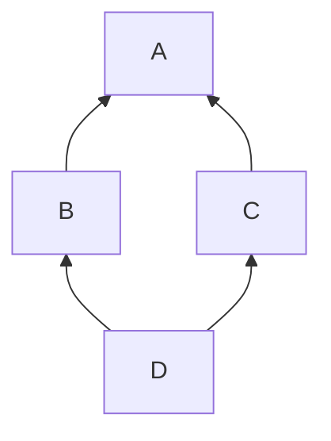
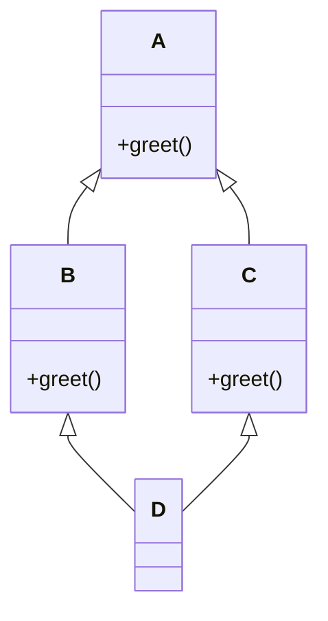

# Klassenbeziehungen
[Zu den Aufgaben](./01_klassenbeziehungen-aufgaben)
## Assoziation
Eine **Assoziation** beschreibt eine Verbindung zwischen zwei Objekten unterschiedlicher Klassen. Diese Beziehung
impliziert keine Ownership, sondern lediglich eine Verknüpfung, die das Interagieren von Objekten ermöglicht.

Im folgenden Beispiel hat der `MemController` Zugriff auf ein oder kein `Component`-Objekt. Die Methode `set_connected`
im `MemController` sorgt dafür, dass dieser mit dem `Component`-Objekt kommuniziert.



### Beispiel in Python:
```python
from typing import Optional

class Component:
    __connected: bool
    
    def __init__(self) -> None:
        self.__connected = False
    
    def get_connected(self) -> bool:
        return self.__connected
    
    def set_connected(self, connected: bool) -> None:
        self.__connected = connected


class MemController:
    __component: Optional[Component]
    
    def __init__(self) -> None:
        self.__component = None

    def set_component(self, component: Optional[Component]) -> None:
        self.__component = component

    def set_connected(self, connected: bool) -> None:
        if self.__component is not None:
            self.__component.set_connected(connected)
```

In diesem Fall kann der `MemController` über die Methode `set_component` eine Referenz zu einem `Component`-Objekt
setzen oder löschen. Die Methode `set_connected` ermöglicht die Steuerung der Verbindung des `Component`-Objekts.

---

## Aggregation
Eine **Aggregation** stellt eine "Teil-Ganzes"-Beziehung dar, bei der ein Objekt eine Sammlung von Objekten einer
anderen Klasse verwaltet. Im Gegensatz zur Komposition existieren die enthaltenen Objekte unabhängig von der
aggregierenden Klasse.

Im folgenden Beispiel kann ein `MemController`-Objekt mehrere `Component`-Objekte verwalten und deren Verbindungsstatus
steuern.



### Beispiel in Python:
```python
from typing import List

class Component:
    __connected: bool
    
    def __init__(self) -> None:
        self.__connected = False
    
    def get_connected(self) -> bool:
        return self.__connected
    
    def set_connected(self, connected: bool) -> None:
        self.__connected = connected


class MemController:
    __components: List[Component]
    
    def __init__(self) -> None:
        self.__components = []

    def add_component(self, component: Component) -> None:
        self.__components.append(component)

    def set_connected(self, connected: bool) -> None:
        for component in self.__components:
            component.set_connected(connected)
```

Hier wird dem `MemController`-Objekt ermöglicht, eine Liste von `Component`-Objekten zu verwalten. Die Methode `set_connected` wird auf jedes `Component`-Objekt angewendet, das dem `MemController` hinzugefügt wurde.

---

## Komposition
Eine **Komposition** stellt eine starke "Teil-Ganzes"-Beziehung dar, bei der die Existenz eines Objekts ohne das andere nicht möglich ist. Im Gegensatz zur Aggregation kann das enthaltene Objekt nicht unabhängig existieren.

Im folgenden Beispiel hat der `MemController` ein `Component`-Objekt, dessen Lebenszyklus direkt vom `MemController` abhängt.



### Beispiel in Python:
```python
class Component:
    __connected: bool
    
    def __init__(self) -> None:
        self.__connected = False
    
    def get_connected(self) -> bool:
        return self.__connected
    
    def set_connected(self, connected: bool) -> None:
        self.__connected = connected


class MemController:
    __component: Component
    
    def __init__(self) -> None:
        self.__component = Component()

    def get_connected(self) -> bool:
        return self.__component.get_connected()
        
    def set_connected(self, connected: bool) -> None:
        if self.__component is not None:
            self.__component.set_connected(connected)
```

In diesem Fall wird das `Component`-Objekt im Konstruktor des `MemController`-Objekts instanziiert und ist nur innerhalb des `MemController` verfügbar. Der Lebenszyklus des `Component`-Objekts hängt somit vollständig vom `MemController` ab.

---

## Vererbung
**Vererbung** ist ein Mechanismus, mit dem eine Klasse Eigenschaften und Methoden einer anderen Klasse erben kann. Dabei
unterscheidet man zwischen Schnittstellen- und Implementierungsvererbung. Die Implementierungsvererbung wird hier näher
erläutert.

Die Implementierungsvererbung ermöglicht es einer abgeleiteten Klasse, alle Methoden und Eigenschaften der Basisklasse
zu übernehmen und bei Bedarf zu erweitern oder zu überschreiben.

Im folgenden Beispiel wird die Klasse `TemperatureComponent` von der Klasse `Component` abgeleitet und erweitert, um
spezifische Funktionen zur Temperaturmessung hinzuzufügen.



### Beispiel in Python:
```python
class Component:
    __connected: bool
    
    def __init__(self) -> None:
        self.__connected = False
    
    def get_connected(self) -> bool:
        return self.__connected
    
    def set_connected(self, connected: bool) -> None:
        self.__connected = connected


class TemperatureComponent(Component):
    __temperature: float

    def __init__(self) -> None:
        # Aufruf des Konstruktors der Basisklasse
        super().__init__()
        self.__temperature = 0.0
        
    def get_temperature(self) -> float:
        return self.__temperature
    
    def set_temperature(self, temperature: float) -> None:
        self.__temperature = temperature
```

In diesem Beispiel erbt die Klasse `TemperatureComponent` von der Klasse `Component`. Dadurch übernimmt sie die Methoden
`get_connected` und `set_connected`, und sie fügt die Methoden `get_temperature` und `set_temperature` hinzu, die
spezifisch für Temperaturmessungen sind.

### Mehrfachvererbung

**Mehrfachvererbung** bedeutet, dass eine abgeleitete Klasse mehr als eine direkte Basisklasse hat.



```python
class A:
    pass

class B:
    pass

class C(A, B):
    pass
```

Hier erbt `C` sowohl von `A` als auch von `B`.

#### Diamantproblem

Das **Diamantproblem** (engl. diamond problem) tritt auf, wenn ein Klassen-Vererbungsschema in Form eines „Diamanten“ entsteht.
Ein typisches Beispiel:



In Python würde dies wie folgt aussehen.

```python
class A:
    def greet(self) -> None:
        print("Hallo von A")

class B(A):
    def greet(self) -> None:
        print("Hallo von B")

class C(A):
    def greet(self) -> None:
        print("Hallo von C")

class D(B, C):
    pass

d = D()
d.greet()
```

In diesem Fall hat Python mehrere mögliche Kandidaten für `greet()`:

 - `B.greet()`

 - `C.greet()`

 - und falls weder in `B` noch in `C` etwas gefunden würde, dann `A.greet()`.

### MRO (Method Resolution Order)
Um Ambiguitäten und Mehrfachaufrufe derselben Methode aus derselben Basisklasse zu vermeiden, folgt Python einer klar 
definierten Reihenfolge bei der Methodenauflösung. Diese Reihenfolge heißt MRO (Method Resolution Order).

Jede Klasse hat ein Attribut `__mro__`, in dem die Reihenfolge aufgeführt ist:

```python
>>> D.__mro__
(<class '__main__.D'>, <class '__main__.B'>, <class '__main__.C'>, <class '__main__.A'>, <class 'object'>)
```

Oder man verwendet die Methode `mro()`:

```python
>>> D.mro()
[<class '__main__.D'>, <class '__main__.B'>, <class '__main__.C'>, <class '__main__.A'>, <class 'object'>]
```

Die Reihenfolge sagt:  
1. Suche zuerst in `D` selbst.  
2. Dann in `B`.  
3. Dann in `C`.  
4. Dann in `A`.  
5. Zum Schluss in `object` (die Wurzel aller Klassen in Python).

Wenn man `d.greet()` ausführt, sucht Python zunächst in `D` nach `greet()`. Falls nicht vorhanden, in `B`, dann in `C`, dann in `A`. Da `B` eine `greet()`-Methode hat, wird diese verwendet:

```python
d = D()
d.greet()  # Gibt "Hallo von B" aus
```

### Erklärung zur `super()`-Methode
Die Funktion `super()` wird in Python verwendet, um auf die Basisklasse zuzugreifen und deren Methoden (insbesondere den
Konstruktor) aufzurufen. Dadurch wird sichergestellt, dass alle Eigenschaften und Initialisierungsschritte der Basisklasse korrekt übernommen werden. 

- **Verwendung in Konstruktoren:**  
  In abgeleiteten Klassen wird `super().__init__()` verwendet, um den Konstruktor der Basisklasse auszuführen. 
  Dadurch wird garantiert, dass alle benötigten Attribute aus der Basisklasse initialisiert werden, bevor weitere
  Initialisierungsschritte in der abgeleiteten Klasse stattfinden.

- **Method Resolution Order (MRO):**  
  Python benutzt eine sogenannte _Method Resolution Order_, um zu bestimmen, in welcher Reihenfolge Basisklassen
  abgefragt werden, falls eine abgeleitete Klasse mehrfach erbt. `super()` berücksichtigt diese Reihenfolge automatisch
  und erleichtert somit das Aufrufen von Basisklassenmethoden in Mehrfachvererbungsszenarien.

- **Vermeidung von doppeltem Code:**  
  Da mit `super()` auf Methoden der Basisklasse zugegriffen werden kann, lässt sich Code-Duplikation vermeiden. Methoden 
  müssen so nicht erneut implementiert oder explizit mit dem Basisklassennamen aufgerufen werden.

Dieses Prinzip erleichtert die Wartung und Erweiterung von Klassenhierarchien erheblich und stellt sicher, dass sowohl
die Basisklasse als auch deren abgeleitete Klassen korrekt initialisiert werden.

[Zu den Aufgaben](./01_klassenbeziehungen-aufgaben)
