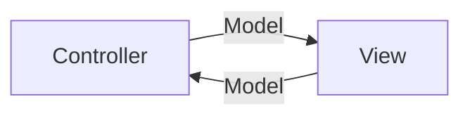

## MVC-Controller
Das **MVC** (Model-View-Controller) Muster ist ein Software-Design-Pattern, das in vielen Webanwendungen und Softwarearchitekturen verwendet wird. Der **Controller** ist eine der zentralen Komponenten dieses Musters und spielt eine wichtige Rolle bei der Verarbeitung von Benutzeranfragen und der Steuerung des Programmlaufs.

### Model
- Speichert die Anwendungsdaten und den Zustand.
- stellt Datenstruktur der Anwendung dar
- entspricht einer oder mehreren Klassen

### View
- empfängt Benutzerinteraktionen (z.B. Klicks, Formulareingaben)
- gibt eingegebene Daten an den Controller weiter
- präsentiert die Daten für den Benutzer
- zeigt eine Benutzeroberfläche oder ähnliches
- **Empfangen von Benutzeraktionen:** Der Controller nimmt Anfragen vom Benutzer entgegen (z.B. durch Klicks oder Formulareingaben).

### Aufgaben des Controllers:
- Empfängt Benutzerinteraktionen (z.B. Klicks, Formulareingaben).
- Verarbeitet Eingaben und entscheidet über die nächste Aktion.
- Ruft Daten vom Model ab oder verändert diese.
- Übergibt die Daten an die View zur Darstellung.
- Kontrolliert den Ablauf der Anwendung und sorgt für die Kommunikation zwischen Model und View.

### Funktionsweise:
1. **Eingabe:** Der Controller empfängt eine Anfrage vom View.
2. **Verarbeitung:** Der Controller kann Daten vom Model abfragen und/oder Modifikationen an ihm vornehmen.
3. **Ausgabe:** Die View wird mit neuen Daten oder einer Bestätigung aktualisiert, die dem Benutzer angezeigt werden.

## MVVM - Model-View-ViewModel

Funktioniert ähnlich wie MVC, aber mit einer zusätzlichen Schicht, dem ViewModel. Der Controller ist hier meist durch das ViewModel ersetzt.
Das MVVM ist dynamischer aufgrund seines eventbasierten Systems.

??? note "Datenbindung // Events"

    Es gibt wesentliche Unterschiede, wie häufig die Daten vom Model an die View übergeben werden:

    | **MVC**                                                          | **MVVM**                                                                                                                  |
    |------------------------------------------------------------------|---------------------------------------------------------------------------------------------------------------------------|
    | View muss bei Änderungen des Models manuell aktualisiert werden. | Unterstützt zweiwegige Datenbindung, bei der Änderungen im Modell automatisch in der View angezeigt werden und umgekehrt. |

## Microservices:
Microservices teilen eine monolithische Anwendung in kleinere, unabhängige Services auf, die jeweils eine spezifische Funktionalität anbieten. Diese Services kommunizieren über APIs und können unabhängig voneinander skaliert und gewartet werden.
Siehe auch: [Video](https://youtu.be/y8OnoxKotPQ)

## Client-Server-Architektur:
Diese Architektur trennt die Anwendung in zwei Hauptkomponenten: den Client (der die Anfragen stellt) und den Server (der die Anfragen verarbeitet). Sie wird häufig in Webanwendungen oder Datenbankanwendungen verwendet.
