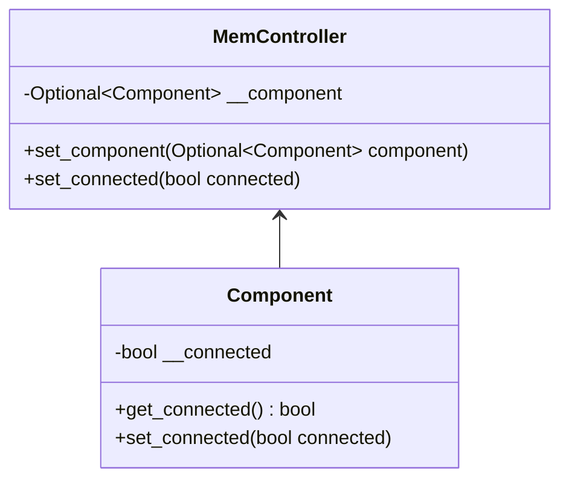
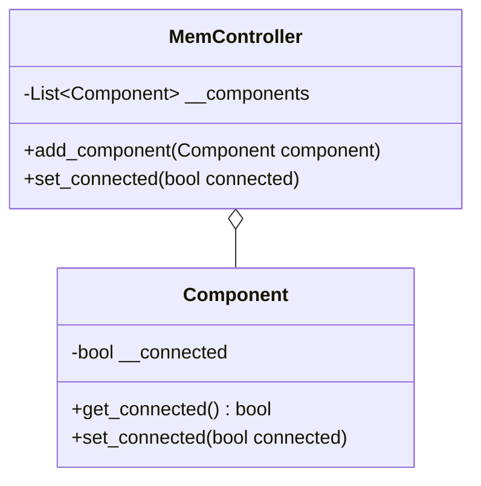
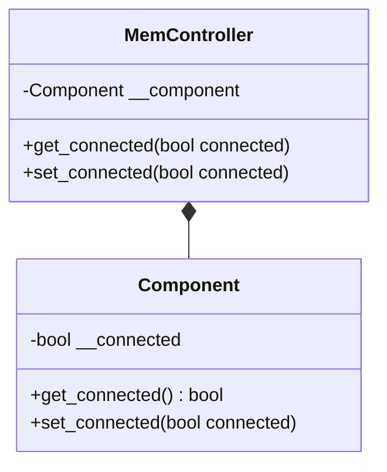
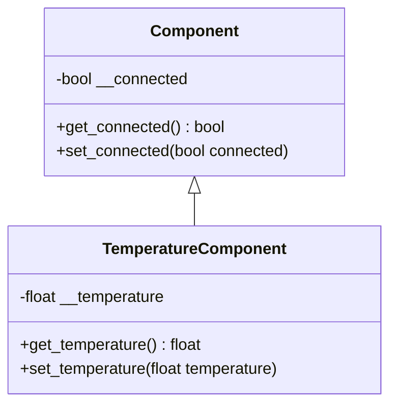

# Klassenbeziehungen

## Assoziation
Eine Assoziation ist eine Verbindung zwischen zwei Objekten von zwei Klassen.



In diesem Beispiel hat der MemController Zugriff auf ein oder kein `Component`.
Die `set_connected`-Methode im `MemController` sorgt dafür das dieser mit dem `Component` kommuniziert.

```python
from typing import Optional

class Component:
    __connected: bool
    
    def __init__(self) -> None:
        self.__connected = False
    
    def get_connected(self) -> bool:
        return self.__connected
    
    def set_connected(self, connected: bool) -> None:
        self.__connected = connected


class MemController:
    __component: Optional[Component]
    
    def __init__(self) -> None:
        self.__component = None

    def set_component(self, component: Optional[Component]) -> None:
        self.__component = component

    def set_connected(self, connected: bool) -> None:
        if self.__component is not None:
            self.__component.set_connected(connected)
```

Über die `set_component`-Methode kann eine Referenz zu einem `Component`-Objekt gesetzt oder gelöscht werden.

## Aggregation
Bei einer Aggregation kann ein Objekt einer Klasse eine Verbindung zu mehreren Objekten einer anderen Klasse unterhalten.
In dem unteren Beispiel kann ein `MemController`-Objekt den Verbindungsstatus mehrerer `Component`-Objekte steuern.



In diesem Beispiel kann nun dem `MemController`-Objekt `Component`-Objekte hinzugefügt werden. Diese Referenzen
hält dieser dann in einer Liste.

```python
from typing import List

class Component:
    __connected: bool
    
    def __init__(self) -> None:
        self.__connected = False
    
    def get_connected(self) -> bool:
        return self.__connected
    
    def set_connected(self, connected: bool) -> None:
        self.__connected = connected


class MemController:
    __components: List[Component]
    
    def __init__(self) -> None:
        self.__components = []

    def add_component(self, component: Component) -> None:
        self.__components.append(component)

    def set_connected(self, connected: bool) -> None:
        for component in self.__components:
            component.set_connected(connected)
```


## Komposition
Eine Komposition besteht dann, wenn die Existenz zweier Objekte voneinander abhängt. Dies ist dann von Vorteil,
wenn die Funktionalität einer Klasse erweitert werden soll.



In Python lässt sich eine saubere Komposition nur dann realisieren, wenn eine Referenzbildung zum Kind-Objekt
außerhalb des Eltern-Objekts verhindert wird. So ist in dem unteren Beispiel das `component`-Attribut der
`MemController`-Klasse privat und jegliche Funktionsaufrufe werden durchgereicht. Außerdem wird das
`Component`-Objekt im Konstruktor der `MemController`-Klasse initialisiert.


```python
class Component:
    __connected: bool
    
    def __init__(self) -> None:
        self.__connected = False
    
    def get_connected(self) -> bool:
        return self.__connected
    
    def set_connected(self, connected: bool) -> None:
        self.__connected = connected


class MemController:
    __component: Component
    
    def __init__(self) -> None:
        self.__component = Component()

    def get_connected(self) -> bool:
        return self.__component.get_connected()
        
    def set_connected(self, connected: bool) -> None:
        if self.__component is not None:
            self.__component.set_connected(connected)
```

## Vererbung
Durch Vererbung kann das Interface und Verhalten einer Klasse an eine andere weitergegeben werden.
Hierbei unterscheidet mann zwischen Schnittstellen- und Implementationsvererbungen.
Die Implementationsvererbung werde ich nun näher beleuchten.

Um eine Implementationsvererbung handelt es sich, wenn eine Klasse von einer anderen vollfunktionsfähigen Klasse
abgeleitet wird, wobei der abgeleiteten Klasse alle Methoden und Eigenschaften der Basisklasse
übertragen werden und diese mit der Basisklasse vollständig kompatibel wird.
Diesen abgeleiteten Klassen können nun Methoden hinzugefügt oder vorhandene Methoden
ausgetauscht werden. Innerhalb der Basisklasse ist ein Aufruf der ursprünglichen Implementation
einer ersetzten Methode aber weiterhin möglich.



In diesem Fall wird nun die `Component`-Klasse von der `TemperatureComponent`-Klasse geerbt
und um die Methoden `get_temperature` und `set_temperature` erweitert.
Dabei hat die `TemperatureComponent`-Klasse weiterhin die `get_connected` und `set_connected` Methoden.

```python
class Component:
    __connected: bool
    
    def __init__(self) -> None:
        self.__connected = False
    
    def get_connected(self) -> bool:
        return self.__connected
    
    def set_connected(self, connected: bool) -> None:
        self.__connected = connected


# Zu erbende Klasse in Klammern hinter Klassenbezeichner
class TemperatureComponent(Component):
    __temperature: float

    def __init__(self) -> None:
        # __init__ Implementation der Basisklasse
        super().__init__()
        
        self.__temperature = 0.0
        
    def get_temperature(self) -> float:
        return self.__temperature
    
    def set_temperature(self, temperature: float) -> None:
        self.__temperature = temperature
```
