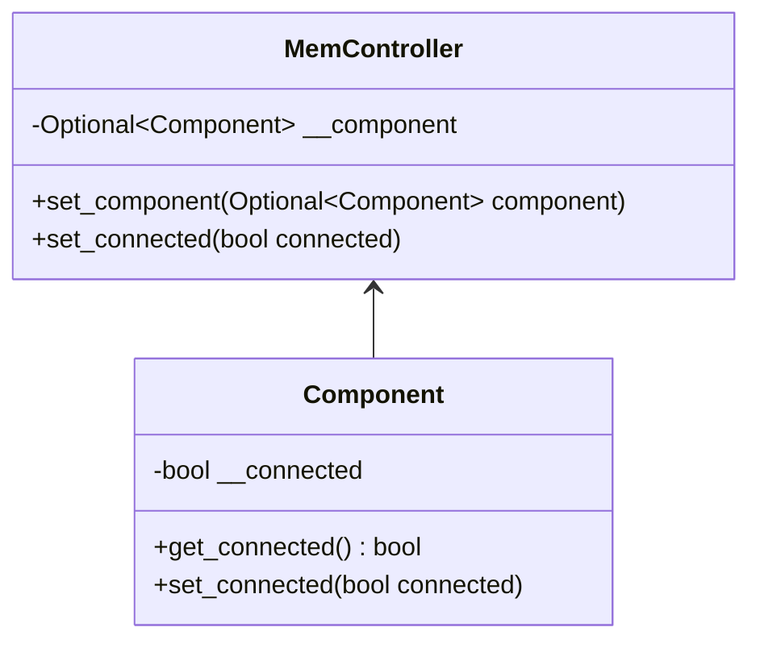
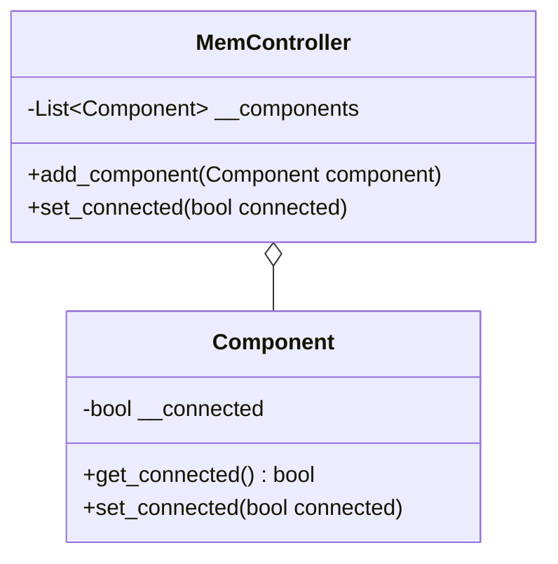
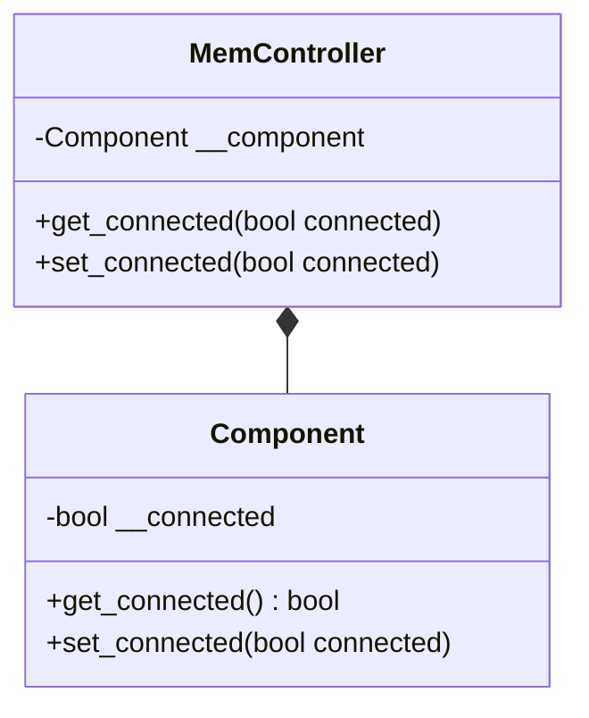
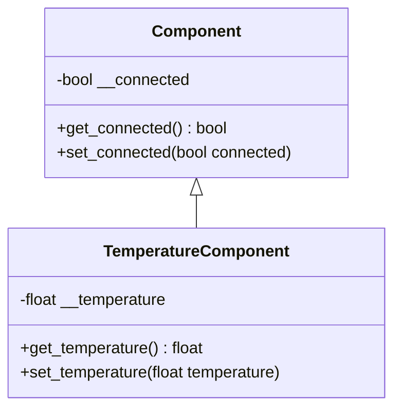

# Klassenbeziehungen

## Assoziation
Eine **Assoziation** beschreibt eine Verbindung zwischen zwei Objekten unterschiedlicher Klassen. Diese Beziehung
impliziert keine Ownership, sondern lediglich eine Verknüpfung, die das Interagieren von Objekten ermöglicht.

Im folgenden Beispiel hat der `MemController` Zugriff auf ein oder kein `Component`-Objekt. Die Methode `set_connected`
im `MemController` sorgt dafür, dass dieser mit dem `Component`-Objekt kommuniziert.



### Beispiel in Python:
```python
from typing import Optional

class Component:
    __connected: bool
    
    def __init__(self) -> None:
        self.__connected = False
    
    def get_connected(self) -> bool:
        return self.__connected
    
    def set_connected(self, connected: bool) -> None:
        self.__connected = connected


class MemController:
    __component: Optional[Component]
    
    def __init__(self) -> None:
        self.__component = None

    def set_component(self, component: Optional[Component]) -> None:
        self.__component = component

    def set_connected(self, connected: bool) -> None:
        if self.__component is not None:
            self.__component.set_connected(connected)
```

In diesem Fall kann der `MemController` über die Methode `set_component` eine Referenz zu einem `Component`-Objekt
setzen oder löschen. Die Methode `set_connected` ermöglicht die Steuerung der Verbindung des `Component`-Objekts.

## Aggregation
Eine **Aggregation** stellt eine "Teil-Ganzes"-Beziehung dar, bei der ein Objekt eine Sammlung von Objekten einer
anderen Klasse verwaltet. Im Gegensatz zur Komposition existieren die enthaltenen Objekte unabhängig von der
aggregierenden Klasse.

Im folgenden Beispiel kann ein `MemController`-Objekt mehrere `Component`-Objekte verwalten und deren Verbindungsstatus
steuern.



### Beispiel in Python:
```python
from typing import List

class Component:
    __connected: bool
    
    def __init__(self) -> None:
        self.__connected = False
    
    def get_connected(self) -> bool:
        return self.__connected
    
    def set_connected(self, connected: bool) -> None:
        self.__connected = connected


class MemController:
    __components: List[Component]
    
    def __init__(self) -> None:
        self.__components = []

    def add_component(self, component: Component) -> None:
        self.__components.append(component)

    def set_connected(self, connected: bool) -> None:
        for component in self.__components:
            component.set_connected(connected)
```

Hier wird dem `MemController`-Objekt ermöglicht, eine Liste von `Component`-Objekten zu verwalten. Die Methode `set_connected` wird auf jedes `Component`-Objekt angewendet, das dem `MemController` hinzugefügt wurde.

## Komposition
Eine **Komposition** stellt eine starke "Teil-Ganzes"-Beziehung dar, bei der die Existenz eines Objekts ohne das andere nicht möglich ist. Im Gegensatz zur Aggregation kann das enthaltene Objekt nicht unabhängig existieren.

Im folgenden Beispiel hat der `MemController` ein `Component`-Objekt, dessen Lebenszyklus direkt vom `MemController` abhängt.



### Beispiel in Python:
```python
class Component:
    __connected: bool
    
    def __init__(self) -> None:
        self.__connected = False
    
    def get_connected(self) -> bool:
        return self.__connected
    
    def set_connected(self, connected: bool) -> None:
        self.__connected = connected


class MemController:
    __component: Component
    
    def __init__(self) -> None:
        self.__component = Component()

    def get_connected(self) -> bool:
        return self.__component.get_connected()
        
    def set_connected(self, connected: bool) -> None:
        if self.__component is not None:
            self.__component.set_connected(connected)
```

In diesem Fall wird das `Component`-Objekt im Konstruktor des `MemController`-Objekts instanziiert und ist nur innerhalb des `MemController` verfügbar. Der Lebenszyklus des `Component`-Objekts hängt somit vollständig vom `MemController` ab.

## Vererbung
**Vererbung** ist ein Mechanismus, mit dem eine Klasse Eigenschaften und Methoden einer anderen Klasse erben kann. Dabei
unterscheidet man zwischen Schnittstellen- und Implementierungsvererbung. Die Implementierungsvererbung wird hier näher
erläutert.

Die Implementierungsvererbung ermöglicht es einer abgeleiteten Klasse, alle Methoden und Eigenschaften der Basisklasse
zu übernehmen und bei Bedarf zu erweitern oder zu überschreiben.

Im folgenden Beispiel wird die Klasse `TemperatureComponent` von der Klasse `Component` abgeleitet und erweitert, um
spezifische Funktionen zur Temperaturmessung hinzuzufügen.



### Beispiel in Python:
```python
class Component:
    __connected: bool
    
    def __init__(self) -> None:
        self.__connected = False
    
    def get_connected(self) -> bool:
        return self.__connected
    
    def set_connected(self, connected: bool) -> None:
        self.__connected = connected


class TemperatureComponent(Component):
    __temperature: float

    def __init__(self) -> None:
        super().__init__()
        self.__temperature = 0.0
        
    def get_temperature(self) -> float:
        return self.__temperature
    
    def set_temperature(self, temperature: float) -> None:
        self.__temperature = temperature
```

In diesem Beispiel erbt die Klasse `TemperatureComponent` von der Klasse `Component`. Dadurch übernimmt sie die Methoden
`get_connected` und `set_connected`, und sie fügt die Methoden `get_temperature` und `set_temperature` hinzu, die
spezifisch für Temperaturmessungen sind.
