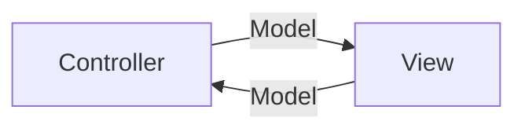

# MVC-Controller

Das **MVC** (Model-View-Controller) Muster ist ein Software-Design-Pattern, das in vielen Webanwendungen und Softwarearchitekturen verwendet wird. Der **Controller** ist eine der zentralen Komponenten dieses Musters und spielt eine wichtige Rolle bei der Verarbeitung von Benutzeranfragen und der Steuerung des Programmlaufs.

## Model
- Speichert die Anwendungsdaten und den Zustand.
- stellt Datenstruktur der Anwendung dar
- entspricht einer oder mehreren Klassen

## View
- empfängt Benutzerinteraktionen (z.B. Klicks, Formulareingaben)
- gibt eingegebene Daten an den Controller weiter
- präsentiert die Daten für den Benutzer
- zeigt eine Benutzeroberfläche oder ähnliches
- **Empfangen von Benutzeraktionen:** Der Controller nimmt Anfragen vom Benutzer entgegen (z.B. durch Klicks oder Formulareingaben).

## Aufgaben des Controllers:
- Empfängt Benutzerinteraktionen (z.B. Klicks, Formulareingaben).
- Verarbeitet Eingaben und entscheidet über die nächste Aktion.
- Ruft Daten vom Model ab oder verändert diese.
- Übergibt die Daten an die View zur Darstellung.
- Kontrolliert den Ablauf der Anwendung und sorgt für die Kommunikation zwischen Model und View.

## Funktionsweise:
1. **Eingabe:** Der Controller empfängt eine Anfrage vom View.
2. **Verarbeitung:** Der Controller kann Daten vom Model abfragen und/oder Modifikationen an ihm vornehmen.
3. **Ausgabe:** Die View wird mit neuen Daten oder einer Bestätigung aktualisiert, die dem Benutzer angezeigt werden.

# MVVM

Das MVVM (Model-View-ViewModel) Muster trennt Präsentation und Geschäftslogik. Das ViewModel spielt eine zentrale Rolle, indem es die View mit dem Model verbindet und für eine reaktionsschnelle Benutzeroberfläche sorgt.

## ViewModel

- Abstraktion der View, die Daten für die Anzeige vorbereitet.
- Bindet Daten aus dem Model und stellt sie der View zur Verfügung.
- Verwaltet Präsentationslogik und reagiert auf Benutzerinteraktionen.

## Aufgaben des ViewModels

- **Datenbereitstellung:** Formatiert und liefert die Daten für die View.
- **Datenbindung:** Automatische Aktualisierung der View bei Änderungen im ViewModel.
- **Präsentationslogik:** Trennung von UI-Logik und Geschäftslogik.
- **Interaktionen:** Verarbeitet Benutzeraktionen und ändert das Model.

## Funktionsweise

- **Eingabe:** Benutzerinteraktionen werden vom ViewModel verarbeitet.
- **Verarbeitung:** Das ViewModel kommuniziert mit dem Model und verarbeitet Eingaben.
- **Ausgabe:** Änderungen im ViewModel aktualisieren automatisch die View.
